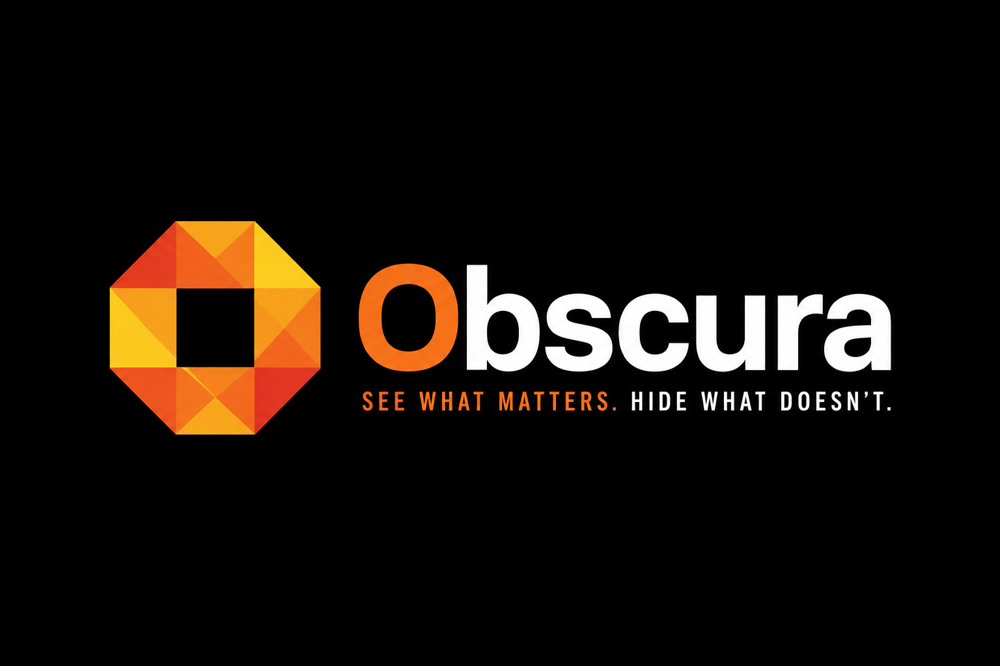

# Obscura — Gemma Clinical Scribe

<p align="center">
  
</p>

Obscura is a focused hackathon clinical scribe. It turns a synthetic clinical conversation into an editable, transcript-grounded SOAP draft.

## Stack

- Focused recording, templates, and review workflow
- OpenRouter-hosted Gemma for note generation
- Groq-hosted Whisper for speech-to-text
- Optional MedGemma 4B Q4 through the local model manager
- FastAPI, React, and Chakra UI

The product and implementation decisions are recorded in [IMPLEMENTATION_PLAN.md](IMPLEMENTATION_PLAN.md).

## Development setup

Requirements: Python 3.12+, `uv`, Node.js, an OpenRouter API key, and a Groq API key.

```bash
npm install
cd server && uv sync --dev && cd ..
npm run dev
```

Open **Settings**, select **Use OpenRouter + Groq defaults**, paste both API keys,
and save. No model download or Tauri build is needed for the presentation path.

## Safety boundary

This is an educational prototype, not a medical device or a HIPAA-compliant clinical system. Hosted providers receive the synthetic demo audio and transcript. Use synthetic or acted conversations only. Every generated note is an unverified draft that requires clinician review.
